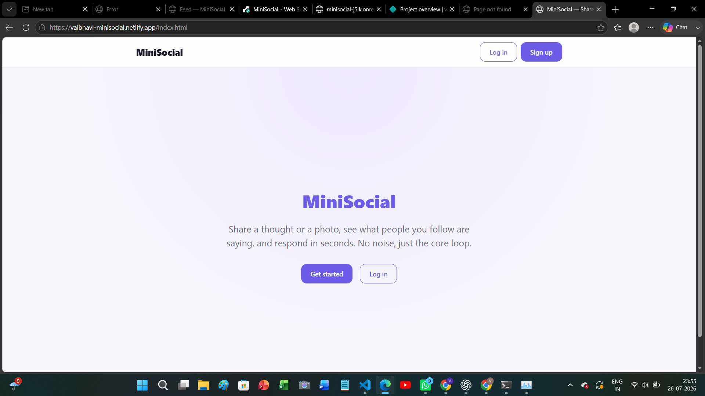
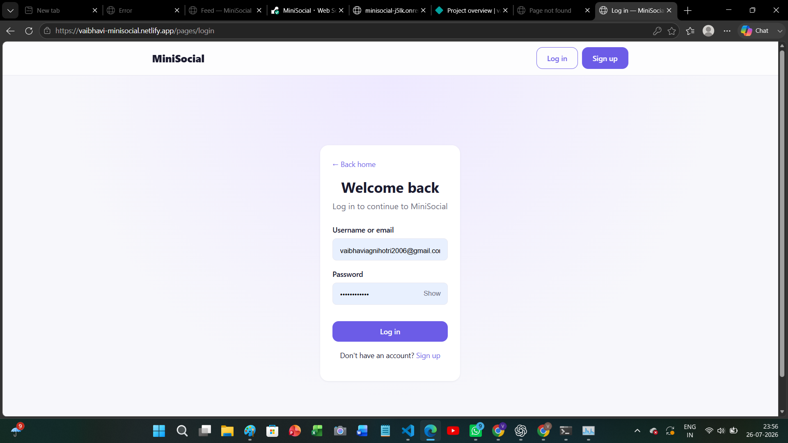
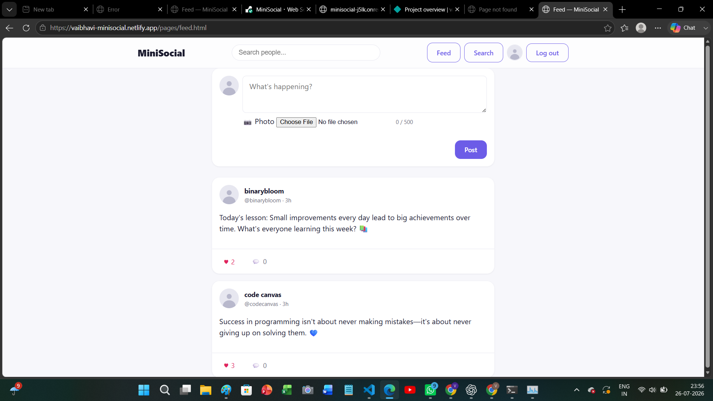
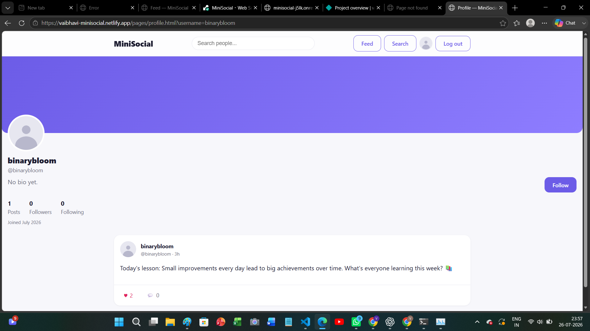

# MiniSocial 🚀

A full-stack social media platform built from scratch that allows users to create accounts, share posts, interact with content, and manage their profiles.

🔗 **Live Demo:** https://vaibhavi-minisocial.netlify.app/

---

## 📌 Overview

MiniSocial is a modern social networking application developed to practice and demonstrate full-stack web development concepts including frontend development, REST API design, authentication, database management, and deployment.

The application provides a simple and clean platform where users can register, log in securely, create posts, view feeds, search users, and manage their profiles.

---

# 📸 Screenshots


### Landing Page



### Login Page



### Feed



### Profile



---

## ✨ Features

### 🔐 Authentication

* User registration and login
* JWT-based authentication
* Protected routes
* Secure password hashing using bcrypt
* Session management with local storage

### 👤 User Features

* User profile management
* View user information
* Search users
* Follow-based social experience

### 📝 Posts

* Create and view posts
* Display posts in a feed
* Single post view
* User-specific posts

### 💬 Comments

* Add comments on posts
* View comment threads
* Manage comments

### 🎨 Frontend

* Responsive multi-page UI
* Clean component-based JavaScript structure
* Dynamic rendering
* Form validation
* Error handling and notifications

### 🚀 Deployment

* Frontend deployed on Netlify
* Backend deployed on Render
* MongoDB Atlas cloud database integration

---

# 🛠 Tech Stack

## Frontend

* HTML5
* CSS3
* JavaScript (ES6 Modules)

## Backend

* Node.js
* Express.js
* REST API Architecture

## Database

* MongoDB
* Mongoose ODM

## Authentication & Security

* JWT Authentication
* bcrypt.js
* Helmet
* CORS
* Express Rate Limiting
* MongoDB Sanitization

## Deployment

* Netlify (Frontend)
* Render (Backend)
* MongoDB Atlas (Database)

---

# 🏗 Project Structure

```
MiniSocial
│
├── client
│   ├── pages
│   ├── css
│   ├── images
│   └── js
│
├── server
│   ├── controllers
│   ├── models
│   ├── routes
│   ├── services
│   ├── middleware
│   └── config
│
└── README.md
```

---

# ⚙️ Installation & Setup

## Clone Repository

```bash
git clone https://github.com/yourusername/MiniSocial.git
```

Move into the project:

```bash
cd MiniSocial
```

---

# Backend Setup

Navigate to server:

```bash
cd server
```

Install dependencies:

```bash
npm install
```

Create a `.env` file:

```env
PORT=5000
NODE_ENV=development
MONGO_URI=your_mongodb_connection_string
JWT_SECRET=your_secret_key
CORS_ORIGIN=http://127.0.0.1:5500
```

Start backend:

```bash
npm start
```

Backend runs on:

```
http://localhost:5000
```

---

# Frontend Setup

Navigate to client:

```bash
cd client
```

Open `index.html` using Live Server.

Update API URL in:

```
client/js/config.js
```

Example:

```javascript
export const API_BASE_URL =
"https://your-render-backend-url.onrender.com/api";
```


# 🔮 Future Improvements

* Real-time chat using Socket.io
* Notifications system
* Image uploads with cloud storage
* Like and bookmark functionality
* Dark mode
* Infinite scrolling feed
* AI-based content recommendations

---

# 📚 Learning Outcomes

Through this project, I gained practical experience in:

* Building REST APIs
* Connecting frontend and backend
* Implementing authentication systems
* Working with MongoDB databases
* Debugging deployment issues
* Managing environment variables
* Deploying full-stack applications

---

# 👩‍💻 Author

**Vaibhavi Agnihotri**

* GitHub: https://github.com/vaibhaviagnihotri2006-gif
* LinkedIn: https://www.linkedin.com/in/vaibhavi-agnihotri-539741327?utm_source=share&utm_campaign=share_via&utm_content=profile&utm_medium=android_app

---

⭐ If you like this project, consider giving it a star!
